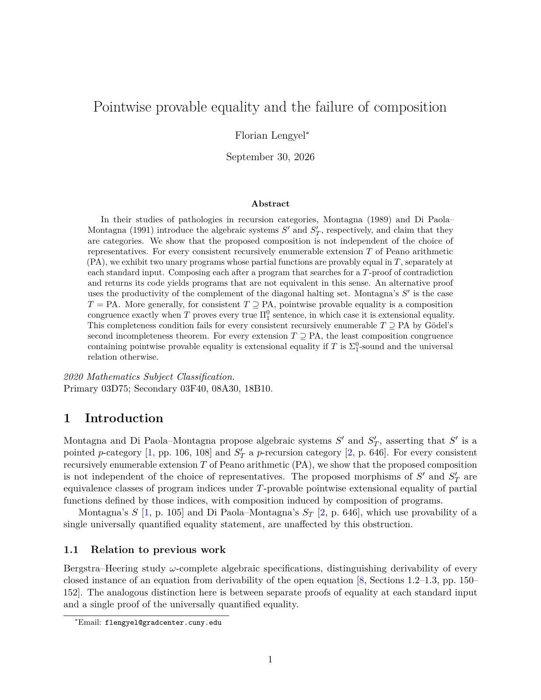

# FailureOfComposition

This is the maintained repository for the Lean formalization and LaTeX source
of Florian Lengyel's *Pointwise provable equality and the failure of composition*.

- [Palomar Registry: PALOMAR-2026-10-01-000013, version 1](https://palomar-registry.org/entry?id=PALOMAR-2026-10-01-000013&version=1)
- [Paper on arXiv (math.LO): DOI 10.48550/arXiv.2609.25556](https://doi.org/10.48550/arXiv.2609.25556)
- [Lean development and verification guide](Lean/FailureOfComposition/README.md)
- Manuscript version 37: [source](manuscript/failure_of_composition_2026-09-30_v37.tex),
  [PDF](manuscript/failure_of_composition_2026-09-30_v37.pdf), and
  [provenance and build instructions](manuscript/README.md)
- [Mathematical statements and Lean signatures](Lean/FailureOfComposition/MANUSCRIPT_STATEMENTS.md)
- [Manuscript-to-Lean coverage map](Lean/FailureOfComposition/MANUSCRIPT_COVERAGE.md)
- [Palomar interface and local verification history](Lean/FailureOfComposition/Palomar/README.md)
- [Codex setup in WSL2](docs/CODEX_WSL_SETUP.md) and
  [first toolchain-port task](docs/CODEX_PORT_TASK.md)

The development proves the failure of induced composition on pointwise
provability classes, the Pi-one completeness characterization, the classification
of the generated composition congruence, and the weak-totality and range
obstructions. The coverage map states the exact program-index scope.
Version 37 revises the exposition and related work while preserving the
mathematical statements, proofs, and theorem numbering. Palomar Registry
version 1 records the manuscript and corresponding Lean development together
at commit [`fb32a19c4883baad83b286d4594cfbc6b1d2ad5c`](https://github.com/flengyel/FailureOfComposition/tree/fb32a19c4883baad83b286d4594cfbc6b1d2ad5c).
Later manuscript and documentation revisions on `main` do not change that
immutable registered snapshot.

## Paper

[](manuscript/failure_of_composition_2026-09-30_v37.pdf)

[Read the current manuscript (PDF)](manuscript/failure_of_composition_2026-09-30_v37.pdf) |
[arXiv DOI](https://doi.org/10.48550/arXiv.2609.25556)

## Repository layout and history

The mathematical development and its verifier are in `Lean/`. The two declared
libraries are `FailureOfComposition` and the 31 pinned `CategoricalRiceShapiro`
evaluator modules it uses. The default build target is `FailureOfComposition`.
The Lake package name remains `CategoricalRiceShapiro` to preserve the dependency
manifest; it does not identify the repository where development is maintained.

The formalization was developed in
[flengyel/Categorical_Rice_Shapiro](https://github.com/flengyel/Categorical_Rice_Shapiro)
before moving here. That repository is the historical origin of the exported
code and verification records. [ROOTPROVENANCE.json](ROOTPROVENANCE.json) records
the initial export, including its input/output hashes and packaging changes.
Its flags describe that export event. It is not a manifest of later commits:
this repository has since been initialized, published, and extended with the
manuscript and updated documentation.

## Verification

The Lean 4.35.0-rc2 port at `d2100df` passed the independent WSL rerun on
2026-09-25. With that toolchain and the pinned dependencies installed under
this checkout's `Lean/.lake/packages`, run from this directory:

```sh
bash scripts/verify-failure-composition.sh --check-environment
bash scripts/verify-failure-composition.sh
```

The environment check invokes no Lake command. Full verification builds the
library and runs the style, theorem, dependency, and kernel checks. The
[evaluator style cleanup](Lean/FailureOfComposition/Porting/STYLE_CLEANUP.md)
extends warnings-as-errors checks to all 31 evaluator sources. The cleanup
passed its full WSL verification; see the
[validation record](Lean/FailureOfComposition/Porting/STYLE_CLEANUP_VALIDATION.json).
`CRS_LAKE_PACKAGES` may supply an existing package mapping. The scripts validate
the dependency pins and do not fetch new checkouts.

For a source checkout on `/mnt/c`, use the persistent Linux mirror described in
[scripts/README.md](scripts/README.md). Choose a fresh mirror, such as
`~/src/FailureOfCompositionStandalone`: the existing `~/src/FailureOfComposition`
mirror belongs to the original repository's checkout. Mirror ownership is tied
to its source directory.

## Licensing and Palomar

The Lean formalization and supporting code use the existing
[Apache-2.0 license](LICENSE). The author retains copyright in the manuscript,
which was submitted under arXiv's perpetual, non-exclusive distribution
license; that grant is not a general public reuse license. See the
[manuscript notes](manuscript/README.md).

Palomar's service verification of all nine selected declarations passed on
October 1, 2026. Its automated editorial review identified no blocking
problems, and version 1 was registered that day. The
[registry entry](https://palomar-registry.org/entry?id=PALOMAR-2026-10-01-000013&version=1)
records the exact source revision, selected declarations, verification
evidence, and automated review. The
[verification run](https://github.com/PalomarRegistry/PalomarSubmission/actions/runs/36824750111)
is also public.

The earlier local Comparator and official-verifier runs remain documented in
the [local verification history](Lean/FailureOfComposition/Palomar/README.md)
and [Nine checkpoint status](Lean/FailureOfComposition/Palomar/STATUS.md).
Those records identify their own tested revisions and are distinct from the
subsequent Palomar service verification and registration.
